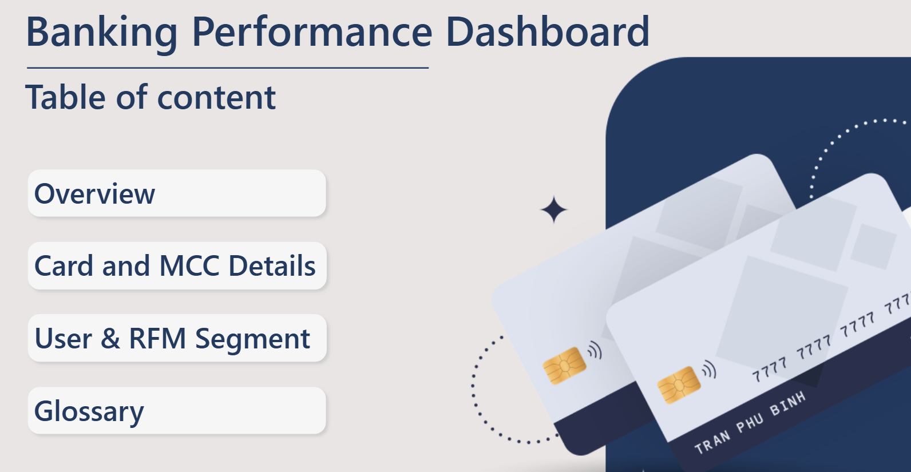
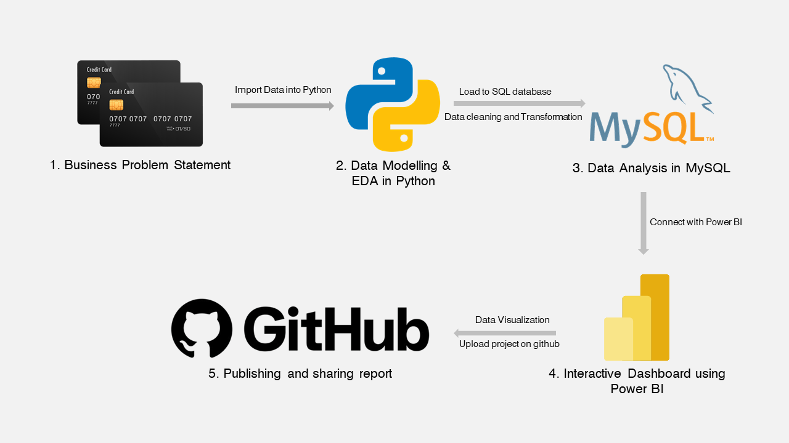
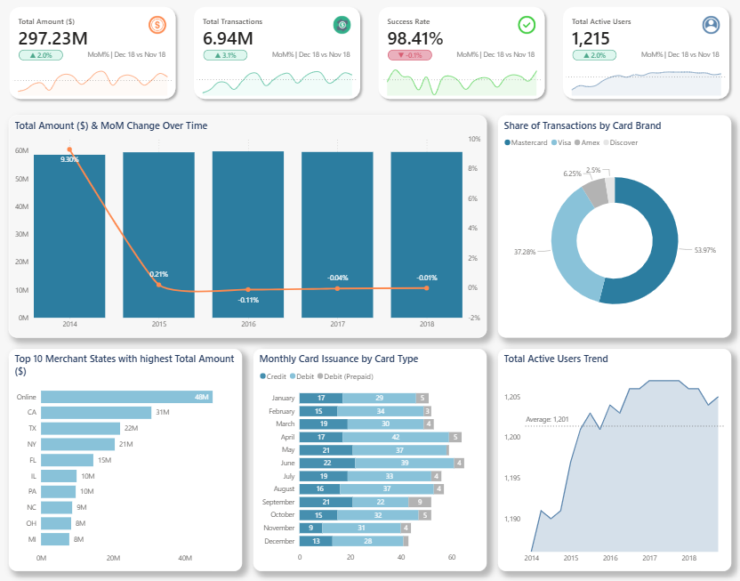
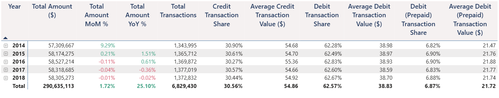
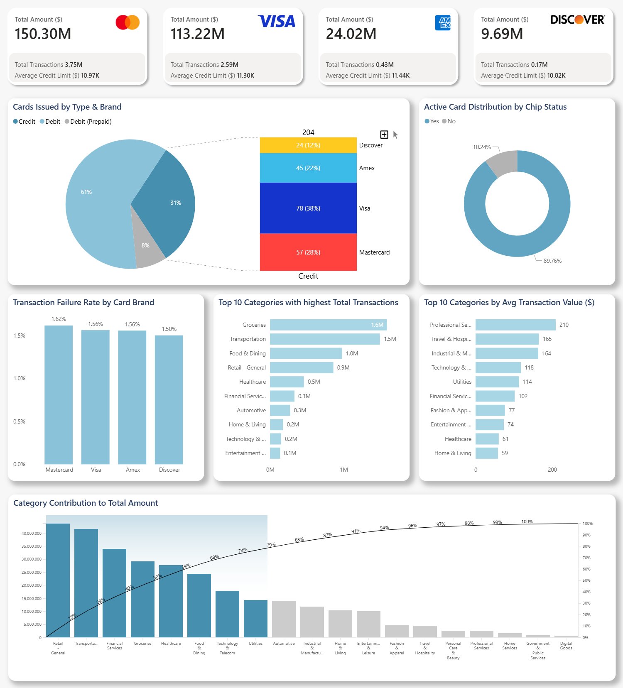
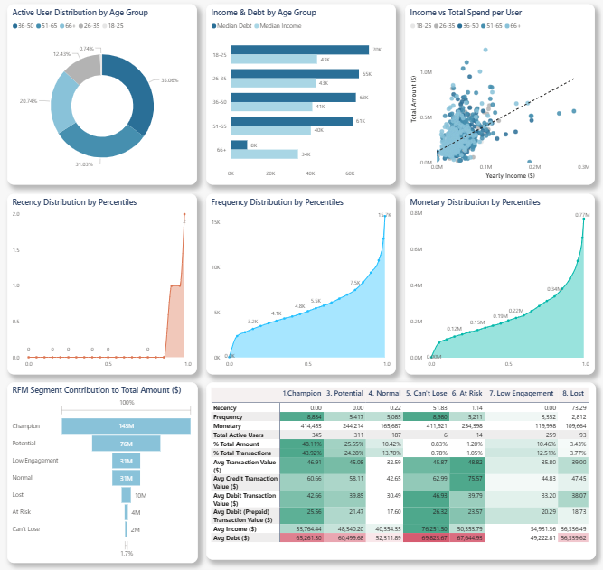

# **🏦 Banking Transaction & Customer Segmentation Analysis**

This project analyzes banking performance from 2014 to 2018, focusing on transaction behavior, card usage, and customer segmentation to generate actionable business insights.

🔗 [**Click here to view Interactive Dashboard on Power BI Service**](https://app.powerbi.com/view?r=eyJrIjoiYzFmNDY3OGEtN2ZiNS00ZGZlLWJiNTUtMWM4NmYxZjU5ODNlIiwidCI6IjVlOGIzMjY5LTc2Y2EtNDU3Yy04NDdmLTQ0NGUzZGI5ODZhNyIsImMiOjl9)

  

**Tech Stack**

- Python: Data cleaning, transformation, EDA

- MySQL: Data storage & querying

- Power BI: Dashboard & visualization

# 🚀 End-to-End Data Pipeline

This project implements a full data pipeline from raw data to insights:

  

# 📊 Performance Dashboard

## 1. Transaction Performance

  

- Total transaction value remains stable (~$60M/year) → low growth.
- Mastercard (53.97%) and Visa (37.28%) dominate transaction share.

- Credit Cards represent 30.56% of transactions but show a significantly higher average value of $54.86, approximately 40% higher than Debit Cards. Debit (Prepaid) account for 6.87%, with a lower average transaction value of $21.72.

👉 Insight:

- Business is driven by **stable** but **low-growth** transaction volume
- Credit cards are key for revenue growth.
## 2. Card & MCC Analysis

- Debit Cards dominate (61%), followed by Credit (31%) and Prepaid (8%) → users show conservative spending behavior 89.76% chip-enabled cards → strong shift toward **contactless payments**
- Transactions concentrate in Groceries, Transportation, Food, Retail → **high-frequency, low-value spending**

⚠️ Risks:

- Low AOV limits revenue growth
- Depends on certain type of categories

## 3. Customer & RFM Segmentation

- Among active users, the 36–50 age group accounts for 35.06%, representing the largest segment with stable income and high spending demand. This is followed by the 51–65 group (31.03%) and 66+ (20.74%).
- There is a clear positive correlation between income and spending level. However, this also raises concerns from a risk management perspective, as higher spending may be associated with increased debt exposure.
- RFM Segment:
    - **Champions and Potential** segments are the core contributors, characterized by **high transaction frequency and value**.
    - Challenges remain in improving engagement among Low Engagement users

# 🎯 Business Recommendations
- Increase credit card adoption to boost revenue
- Based on users' spending behavior (high-frequency, low-value transactions), the business should make personalized promotions by user segment:
    - For Low Engagement and At Risk users: offer **small valued but frequent promotions** to **increase transaction frequency** in order to move them into the Normal segment.
    - For Lost users: provide **stronger promotions** or reactivation offers to encourage return and become **Revived users**.